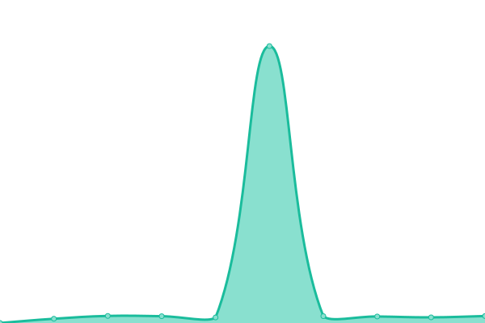

# [📈 Live Status](https://status.project-mei.xyz): <!--live status--> **🟧 Partial outage**

This repository contains the open-source uptime monitor and status page for [Raiden](project-mei.xyz), powered by [Upptime](https://github.com/upptime/upptime).

With [Upptime](https://upptime.js.org), you can get your own unlimited and free uptime monitor and status page, powered entirely by a GitHub repository. We use [Issues](https://github.com/raidensakura/shogun-status/issues) as incident reports, [Actions](https://github.com/raidensakura/shogun-status/actions) as uptime monitors, and [Pages](https://status.project-mei.xyz) for the status page.

<!--start: status pages-->
<!-- This summary is generated by Upptime (https://github.com/upptime/upptime) -->
<!-- Do not edit this manually, your changes will be overwritten -->
<!-- prettier-ignore -->
| URL | Status | History | Response Time | Uptime |
| --- | ------ | ------- | ------------- | ------ |
|  [Main Website](https://project-mei.xyz) | 🟩 Up | [main-website.yml](https://github.com/raidensakura/statuspage/commits/HEAD/history/main-website.yml) | 

 253ms
     
 | 

<a href="https://status.project-mei.xyz/history/main-website">100.00%</a>
    

|  [Dashdot](https://home.project-mei.xyz) | 🟩 Up | [dashdot.yml](https://github.com/raidensakura/statuspage/commits/HEAD/history/dashdot.yml) | 

 543ms
     
 | 

<a href="https://status.project-mei.xyz/history/dashdot">99.22%</a>
    

|  [Portainer](https://portainer.project-mei.xyz/) | 🟩 Up | [portainer.yml](https://github.com/raidensakura/statuspage/commits/HEAD/history/portainer.yml) | 

 503ms
     
 | 

<a href="https://status.project-mei.xyz/history/portainer">99.22%</a>
    

|  [Shogun Bot](https://shogun.project-mei.xyz) | 🟥 Down | [shogun-bot.yml](https://github.com/raidensakura/statuspage/commits/HEAD/history/shogun-bot.yml) | 

 515ms
     
 | 

<a href="https://status.project-mei.xyz/history/shogun-bot">99.22%</a>
    

|  [Shogun Dashboard](https://dash.project-mei.xyz) | 🟩 Up | [shogun-dashboard.yml](https://github.com/raidensakura/statuspage/commits/HEAD/history/shogun-dashboard.yml) | 

 514ms
     
 | 

<a href="https://status.project-mei.xyz/history/shogun-dashboard">99.22%</a>
    

|  [Grafana](https://graph.project-mei.xyz) | 🟩 Up | [grafana.yml](https://github.com/raidensakura/statuspage/commits/HEAD/history/grafana.yml) | 

 551ms
     
 | 

<a href="https://status.project-mei.xyz/history/grafana">99.22%</a>
    

|  [InfluxDB](https://influxdb.project-mei.xyz) | 🟩 Up | [influx-db.yml](https://github.com/raidensakura/statuspage/commits/HEAD/history/influx-db.yml) | 

 501ms
     
 | 

<a href="https://status.project-mei.xyz/history/influx-db">99.22%</a>
    

|  [Makoto (Bot)](https://makoto-modmail-bot.up.railway.app/) | 🟩 Up | [makoto-bot.yml](https://github.com/raidensakura/statuspage/commits/HEAD/history/makoto-bot.yml) | 

 213ms
     
 | 

<a href="https://status.project-mei.xyz/history/makoto-bot">97.36%</a>
    

|  [Makoto (Logviewer)](https://makoto.project-mei.xyz/) | 🟩 Up | [makoto-logviewer.yml](https://github.com/raidensakura/statuspage/commits/HEAD/history/makoto-logviewer.yml) | 

 244ms
     
 | 

<a href="https://status.project-mei.xyz/history/makoto-logviewer">100.00%</a>
    

|  [Teriri (Bot)](https://teriri-modmail-bot.up.railway.app/) | 🟩 Up | [teriri-bot.yml](https://github.com/raidensakura/statuspage/commits/HEAD/history/teriri-bot.yml) | 

 226ms
     
 | 

<a href="https://status.project-mei.xyz/history/teriri-bot">99.19%</a>
    

|  [Teriri (Logviewer)](https://teriri.project-mei.xyz/) | 🟩 Up | [teriri-logviewer.yml](https://github.com/raidensakura/statuspage/commits/HEAD/history/teriri-logviewer.yml) | 

 236ms
     
 | 

<a href="https://status.project-mei.xyz/history/teriri-logviewer">100.00%</a>
    

|  [Archi Steam Farm](https://asf.project-mei.xyz) | 🟩 Up | [archi-steam-farm.yml](https://github.com/raidensakura/statuspage/commits/HEAD/history/archi-steam-farm.yml) | 

 629ms
     
 | 

<a href="https://status.project-mei.xyz/history/archi-steam-farm">99.22%</a>
    

<!--end: status pages-->

[**Visit our status website →**](https://status.project-mei.xyz)

## 📄 License

- Powered by: [Upptime](https://github.com/upptime/upptime)
- Code: [MIT](./LICENSE) © [Raiden](project-mei.xyz)
- Data in the `./history` directory: [Open Database License](https://opendatacommons.org/licenses/odbl/1-0/)
